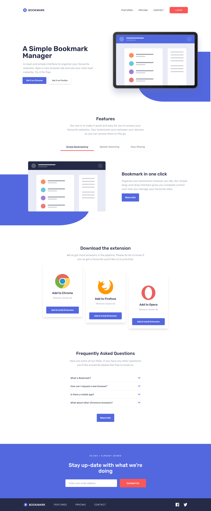

# Frontend Mentor - Bookmark landing page solution

This is a solution to the [Bookmark landing page challenge on Frontend Mentor](https://www.frontendmentor.io/challenges/bookmark-landing-page-5d0b588a9edda32581d29158). Frontend Mentor challenges help you improve your coding skills by building realistic projects. 

## Table of contents

- [Overview](#overview)
  - [Screenshot](#screenshot)
  - [Links](#links)
- [My process](#my-process)
  - [Built with](#built-with)
  - [What I learned](#what-i-learned)
  - [Continued development](#continued-development)
  - [Useful resources](#useful-resources)
- [Author](#author)
- [Acknowledgments](#acknowledgments)

## Overview

### Screenshot




### Links

- Solution URL: [Solution here](https://github.com/MariaCMontO/bookmark-landing-cmo)

## My process

### Built with

- Semantic HTML5 markup
- CSS custom properties
- Flexbox
- Grid
- JavaScript

### What I learned

With this project, I learned how use tailwind. It was so useful to include styles directly in the HTML. I also learned how to use customize properties in tailwind.config.js and how to use @apply annotation.

```css
.underline{
    @apply text-blue950 after:content-[''] after:absolute after:w-1/2 md:after:w-full after:h-1 after:bg-red400 after:left-1/2 after:-translate-x-1/2 after:bottom-0 after:scale-x-100 after:transition-transform after:duration-300 after:ease-linear;
}
```
```html
<div
          class="flex flex-col mx-10 md:mx-[352px] md:flex-row md:justify-center"
          aria-label="Feature tabs"
          role="group"
        >
          <button
            id="simple-bookmarking"
            class="relative text-gray-500 text-sm md:text-base py-4 border-b border-t md:px-10 md:border-t-0 underline hover:text-red400"
            type="button"
            aria-pressed="true"
            aria-label="Click in this label to see 'Simple bookmarking'"
          >
            Simple Bookmarking
          </button>
          <button
            id="speedy-searching"
            class="relative text-gray-500 text-sm md:text-base py-4 border-b md:px-10 hover:text-red400"
            type="button"
            aria-pressed="false"
            aria-label="Click in this label to see 'Speedy Searching'"
          >
            Speedy Searching
          </button>
          <button
            id="easy-sharing"
            class="relative text-gray-500 text-sm md:text-base py-4 border-b md:px-10 hover:text-red400"
            type="button"
            aria-pressed="false"
            aria-label="Click in this label to see 'Easy Sharing'"
          >
            Easy Sharing
          </button>
        </div>
```

### Continued development

I definitely want to keep developing interfaces with tailwind.css to make the work easier and more organized.

### Useful resources

## Author

- Frontend Mentor - [@MariaCMontO](https://github.com/MariaCMontO)


## Acknowledgments